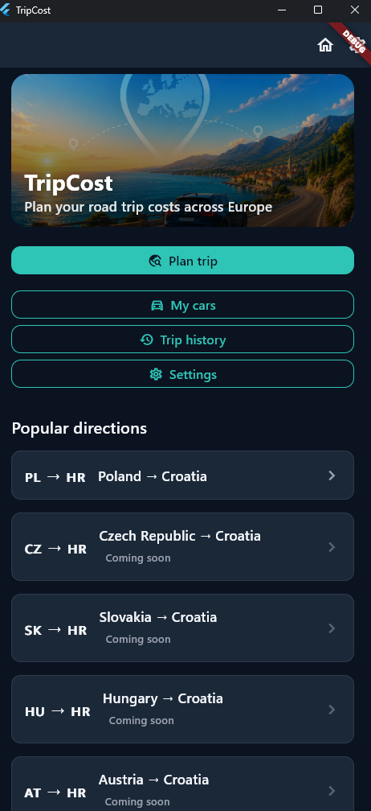
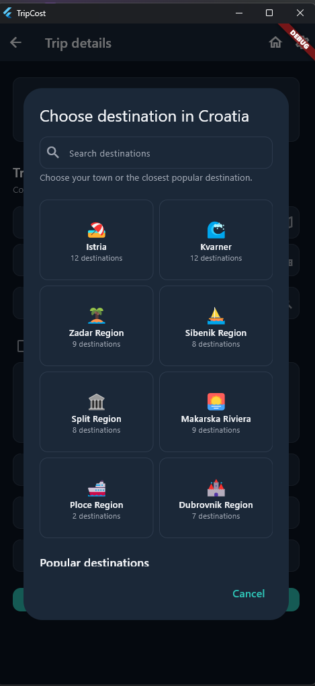
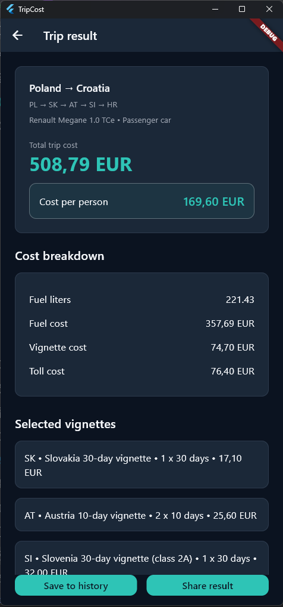
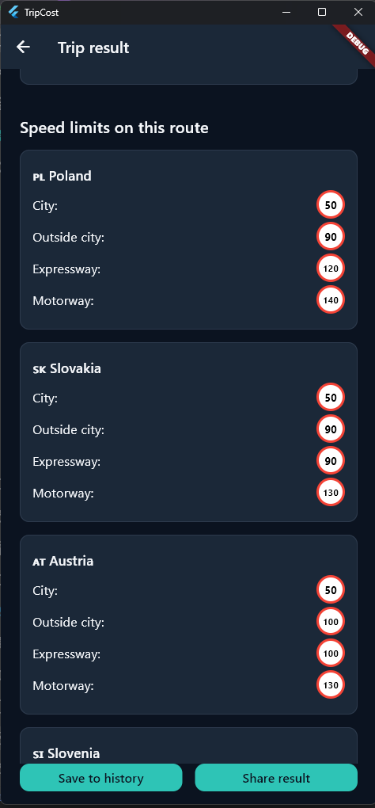
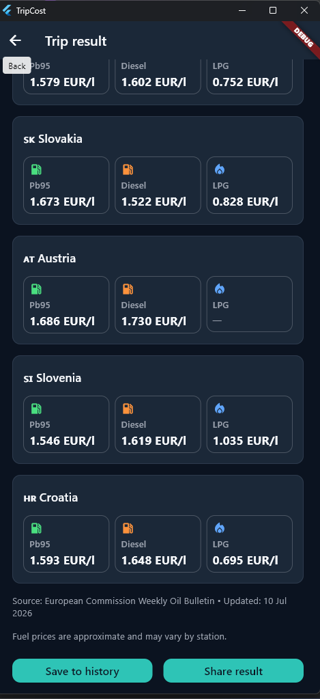
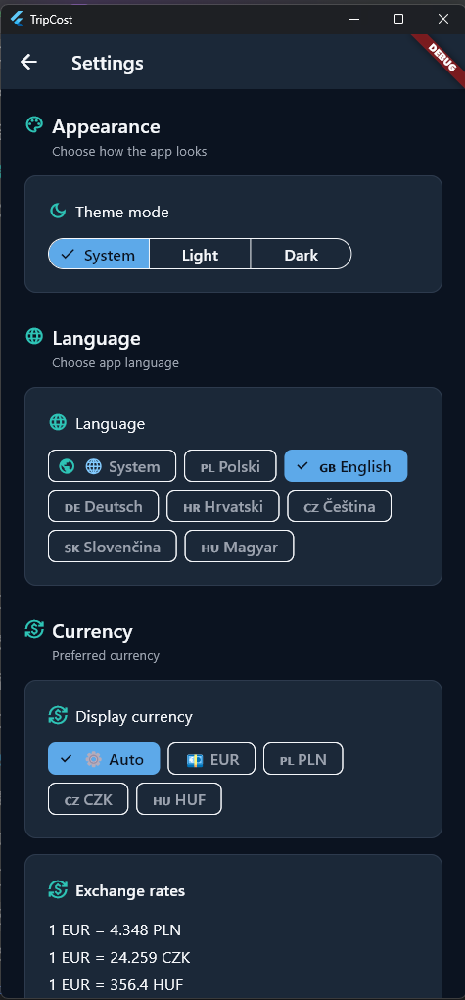

<p align="center">
  
</p>

<h1 align="center">TripCost</h1>

<p align="center">
  <strong>Travel Cost Planner for Europe</strong><br>
  Calculate fuel, tolls, vignettes and ferry costs in one place.
</p>

<p align="center">
  <a href="https://play.google.com/store/apps/details?id=pl.tripcost.app">
    
  </a>
</p>

<p align="center">
  
  
  
  
  
  
</p>

---

## About

TripCost is a Flutter mobile application that helps drivers estimate the total cost of travelling across Europe.

Instead of calculating only fuel consumption, the application combines fuel prices, motorway tolls, vignettes and ferry fees into a single estimate, making trip planning much easier.

The application uses a custom FastAPI backend hosted on a VPS to provide up-to-date travel data.

---

## Screenshots

<p align="center">
  
  
</p>

<p align="center">
  
  
</p>

<p align="center">
  
  
</p>

---

## Features

- Fuel cost calculation
- Fuel prices for multiple European countries
- Toll roads and motorway fees
- European vignette support
- Ferry pricing
- One-way and round-trip calculations
- Vehicle management
- Multi-currency support
- Multi-language interface
- Automatic data synchronization from a custom backend
- Offline local storage

---

## Technology Stack

| Technology | Purpose |
|------------|---------|
| Flutter | Cross-platform mobile application |
| Dart | Programming language |
| FastAPI | Backend API |
| REST API | Data exchange |
| Hive | Local storage |
| JSON | Data source |
| Git | Version control |
| GitHub | Source code hosting |

---

## Project Structure

```text
lib
├── core
├── data
├── domain
├── presentation
├── services
├── widgets
└── utils
```

The project follows a layered architecture that separates business logic, data sources and presentation.

---

## Supported Languages

- 🇵🇱 Polish
- 🇬🇧 English
- 🇩🇪 German
- 🇭🇷 Croatian
- 🇨🇿 Czech
- 🇸🇰 Slovak
- 🇭🇺 Hungarian

---

## Backend

TripCost uses a custom FastAPI backend hosted on a VPS.

The backend provides:

- Fuel prices
- Vignette data
- Toll road information
- Ferry prices
- Application updates

---

## Installation

Clone the repository:

```bash
git clone https://github.com/lbujas/TripCost-Mobile.git
```

Install dependencies:

```bash
flutter pub get
```

Run the application:

```bash
flutter run
```

---

## Roadmap

Planned improvements:

- Additional ferry operators
- More European toll systems
- Route optimization
- Apple CarPlay support
- Android Auto improvements
- Travel statistics
- New travel planning features

---

## Google Play

The application is available on Google Play:

https://play.google.com/store/apps/details?id=pl.tripcost.app

---

## Author

**Łukasz Bujas**

Flutter Developer

GitHub: https://github.com/lbujas